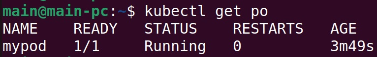
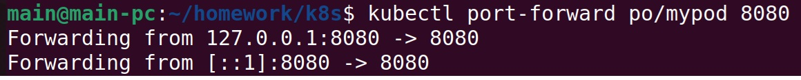
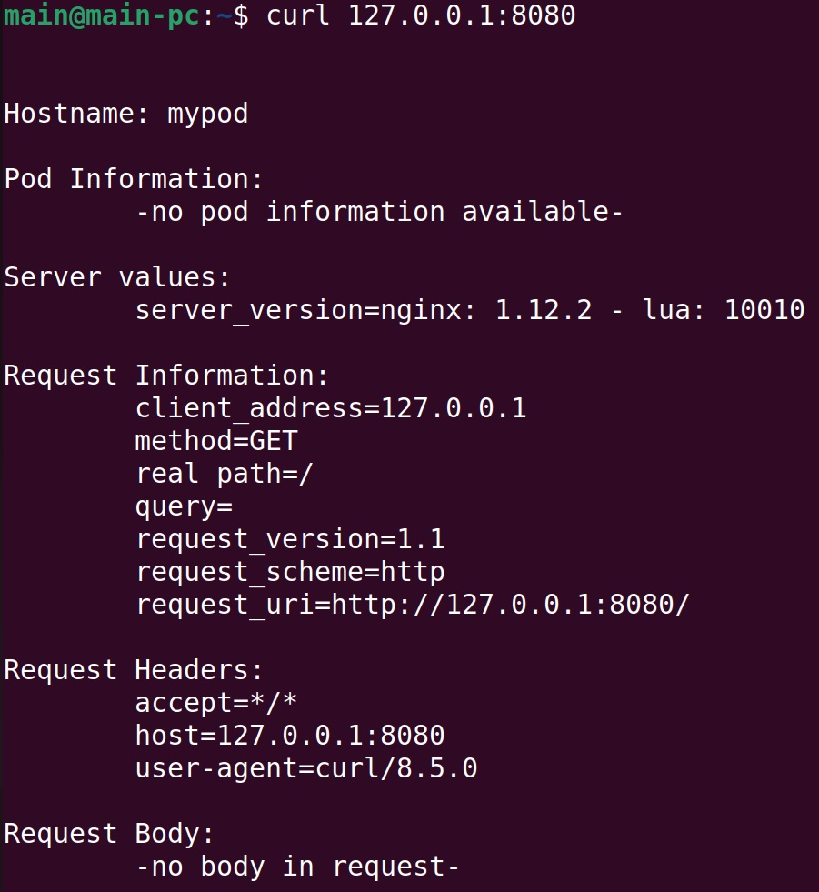
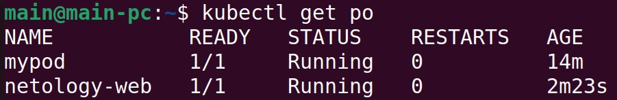
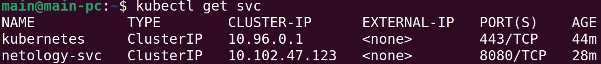
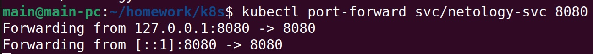
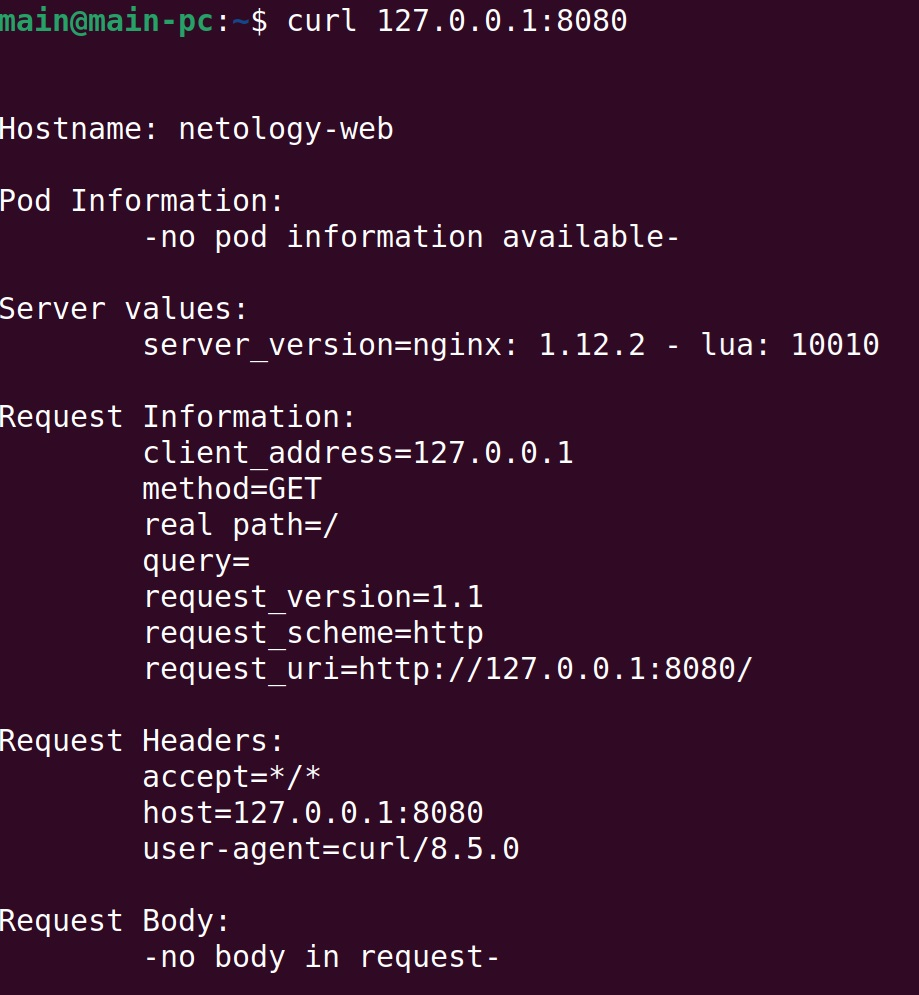

## Решение задания 1

1. Создание Pod:  

2. Подключение к Pod с помощью kubectl port-forward:  

3. Curl:  

## Решение задания 2

1. Создание Pod:  

2. Создание Service:  

3. Подключение к Service с помощью kubectl port-forward:  

4. Curl:  

 